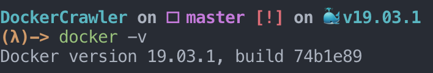
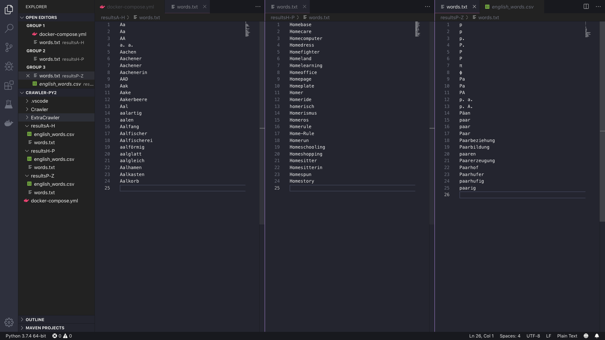

# DockerCrawler
A docker based crawler
Sections:
    + How To Run
    + Explanation
    + Troubleshoot

## How To Run
1. Install Docker Desktop using the steps in: [Docker](https://docs.docker.com/docker-for-mac/install/)
    - Check the instalation is complete by running on your terminal: `docker -v`
    - Output from previous command (output may vary depending on the version):
    - 
2. Clone this repository wherever you like: https://github.com/rxwp5657/DockerCrawler.git
3. Change to the project directory: `cd DockerCrawler`
4. Type the commands:
    +`docker-compose build`
    +`docker-compose up -d`
    + You should see the following output: 
5. The previous output means that three crawlers where made and that are running already...
6. If everything is OK, you should see the following on the files
    + `./resultsA-H/words.txt`
    + `./resultsH-P/words.txt`
    + `./resultP-Z/words.txt`

## Explanation
+ The `docker-compose.yml` is in charge of making multiple crawlers
+ Each crawler process a subset of the words, this is:
    - Crawler  process from A to H 
    - Crawler2 process from H to P 
    - Crawler3 process from P to Z
+ All of the crawlers run the same code described on the file `./ExtraCrawler/extra.py`
+ Each of the crawlers results are saved on their respective folder and, especifically, the file `english_words.csv`

## Troubleshoot
If there is a problem with the docker commands, check:
+ The docker commands must be run on the same folder where the `docker-compose.yml` is located.
+ Check that the docker daemon is runnig by checking your toolbar (it should look like this):
+ 
